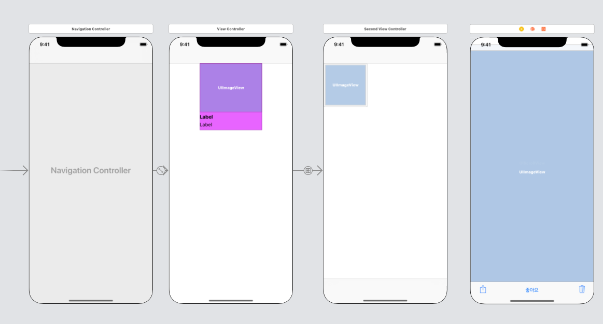
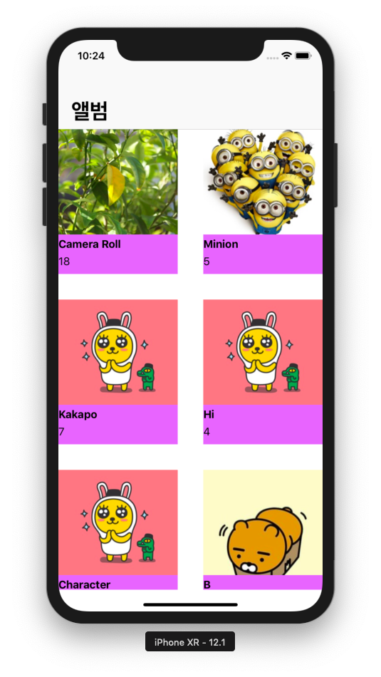
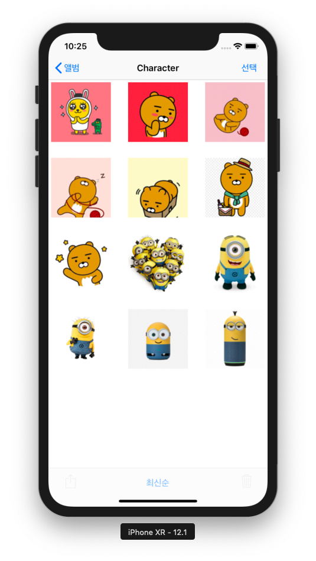
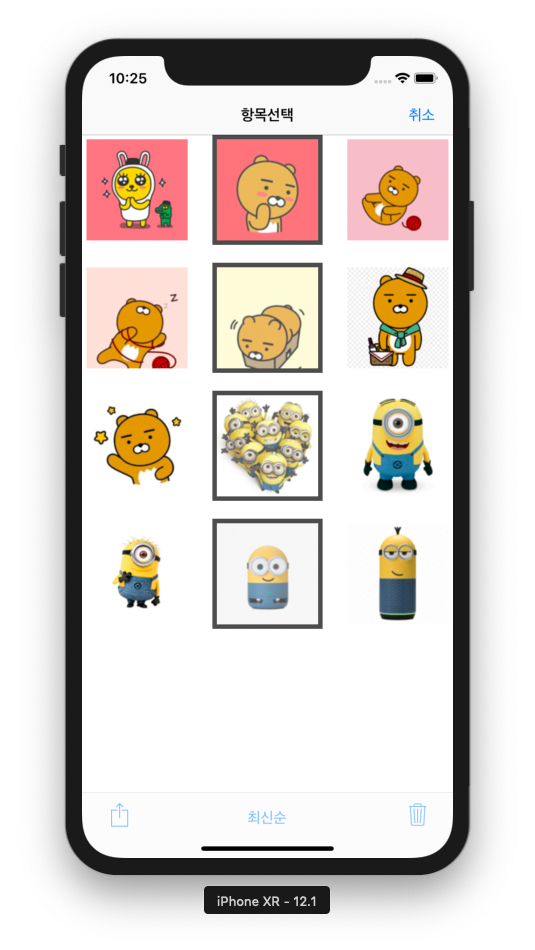
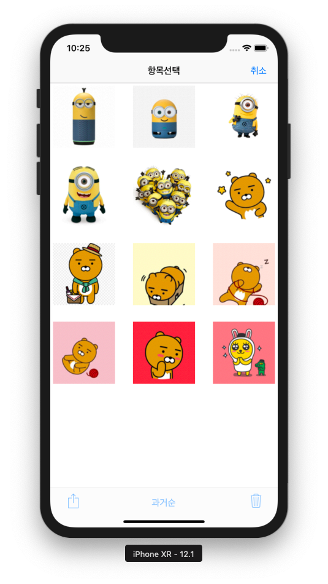
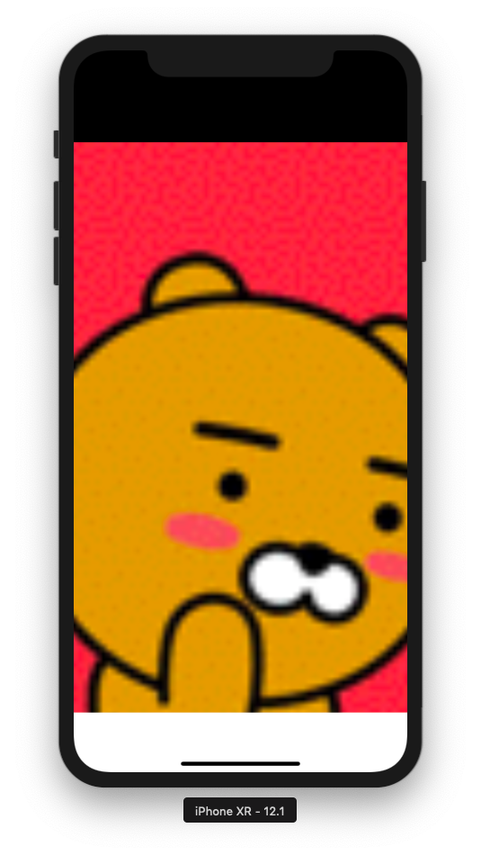

# IOS_boost_Album
## 2019.02.23 ~ 2019.03.07
> 구성
# Album
- View
    - 앨범목록 - [ViewController](#ViewController)
    - 앨범사진들 - [SecondViewController](#SecondViewController)
    - 사진한장 - [ThirdViewController](#ThirdViewController)
    
- 주요기능
    - Photos
    - CollectionView
    - Custom Navigationbar Item
    - Condition Push
    - ScrollView
     
---
> <b>세부기능</b>
## ViewController

- 앨범 이름, 갯수, 최신이미지를 받아서 컬렉션 뷰로 나타냄
- 컬렉션 뷰의 셀을 클릭시 해당앨범의 사진들의 목록이있는 뷰컨트롤러로 이동
---
## SecondViewController
 
 
 

- 선택시 강조효과
- '선택' 클릭시 다중선택가능, 삭제기능 활성화
- 최신순, 과거순으로 사진 정렬
- 단일선택 상태일때만 셀 클릭시 사진한장을 상세히 볼수있는 뷰컨트롤러로 이동
- 네비게이션바 아이템생성, 기능구현
- 툴바기능 구현
---
## ThirdViewController
 
 
 

- 스크롤뷰 줌기능
- 줌할시 네비게이션 숨기기, 툴바숨기기, 배경색바꾸기
- 터치시 네비게이션 보이기
- 원래크기시 처음상태로